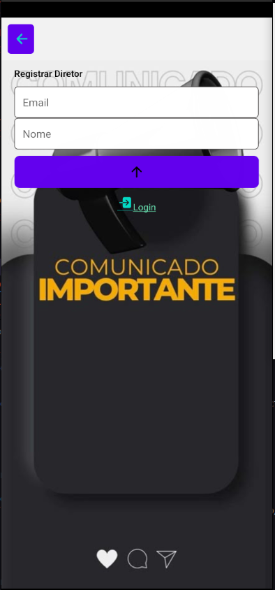
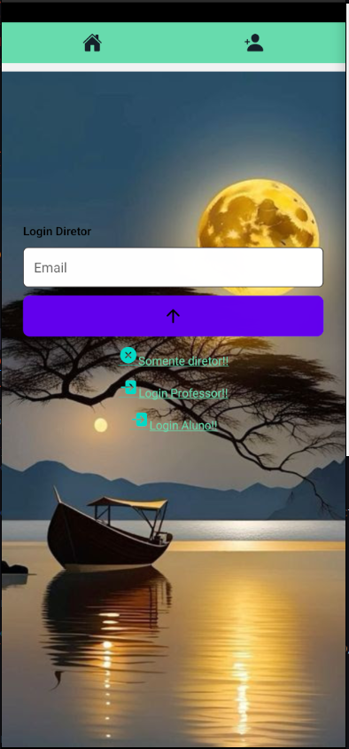

# 📱 School App


- Aplicativo mobile desenvolvido com [Expo](https://expo.dev/), utilizando **Expo Router**, **Context API** para autenticação, **React Native**, e outras bibliotecas.
- O back-end desta aplicação se encontra nesse repositório abaixo:

- [Repository](https://github.com/reinaldoper/back-escola-prisma)

- Abaixo um spoiler da aplicação em desenvolvimento:

- [App-escola](./assets/images/video_escola.gif)


<p align="center">
 
</p>

-

-

---

## 📦 Tecnologias e Dependências

- [Expo](https://expo.dev/)
- [React Native](https://reactnative.dev/)
- [Expo Router](https://expo.github.io/router/docs)
- [React Navigation](https://reactnavigation.org/)
- [react-native-dotenv](https://github.com/goatandsheep/react-native-dotenv)
- [@expo/vector-icons](https://icons.expo.fyi/)
- [react-native-reanimated](https://docs.swmansion.com/react-native-reanimated/)
- [@react-native-picker/picker](https://github.com/react-native-picker/picker)
- [Jest](https://jestjs.io/) (para testes)
- [EAS CLI](https://docs.expo.dev/eas/)

---


---

## ⚙️ Requisitos

Antes de rodar o projeto, você precisa ter instalado:

- [Node.js](https://nodejs.org/en/) (v18+)
- [npm](https://www.npmjs.com/) ou [Yarn](https://yarnpkg.com/)
- [Expo CLI](https://docs.expo.dev/get-started/installation/)
- [EAS CLI](https://docs.expo.dev/eas/)

---

## 🚀 Como rodar o projeto localmente

### 1. Clone o repositório:

```bash
git clone https://github.com/reinaldoper/react-native-app.git
cd react-native-app
```

2. Instale as dependências:

```bash
npm install
# ou
yarn install
```

3. Inicie o projeto:

```bash
npm start
# ou
yarn start
# ou
npx expo start
```

4. Visualize no seu celular:
- Baixe o app Expo Go na App Store ou Google Play.

- Escaneie o QR Code que aparece no terminal com a câmera.


🛠️ Build com EAS

1. Instale o EAS CLI


```bash
npm install -g eas-cli
```

2. Faça login na sua conta Expo:

```bash
eas login
```

3. Crie um build de desenvolvimento:

```bash
eas build -p android --profile development
```

4. Ou para produção:

```bash
eas build -p android --profile production
```

5. Estrutura do projeto:

```bash
react-native-app/
├── app/
│   ├── _layout.tsx
│   ├── index.tsx
│   ├── diretor/
│   ├── student/
│   ├── profile.tsx
│   └── professor/
├── assets/
│   ├── images/
│   └── fonts/
│       └── OpenSans-Regular.ttf
├── components/
│   ├── Inputs.tsx
│   ├── InputText.tsx
│   ├── Logout.tsx
│   ├── NavBar.tsx
│   ├── ProfessorCard.tsx
│   └── login.tsx
├── constants/
│   ├── colors/
│   ├── context/
│   ├── fecthAluno/
│   ├── fetchDiretor/
│   ├── fetchProfessor/
│   ├── routes/
│   ├── selectJson/
│   ├── styles/
│   └── validaEmail
├── .env
├── .gitignore
├── README.md
├── app.json
├── package-lock.json
├── package.json
└── tsconfig.json
```

🔐 Autenticação:

- A autenticação é feita via Context API. 
- O contexto AuthProvider encapsula todas as telas e gerencia o estado do usuário logado, utilizando armazenamento local.


💬 Contato:

- Caso tenha dúvidas, sugestões ou queira contribuir, sinta-se à vontade para abrir uma issue ou me contatar!